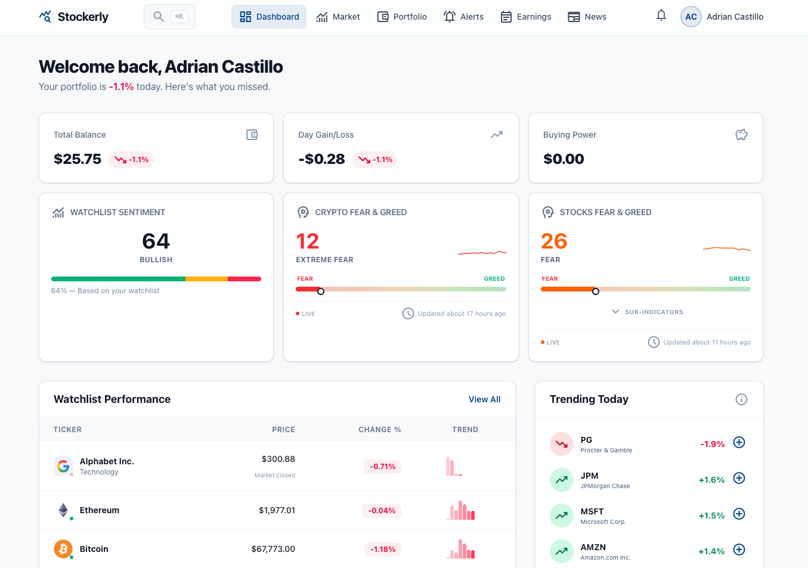
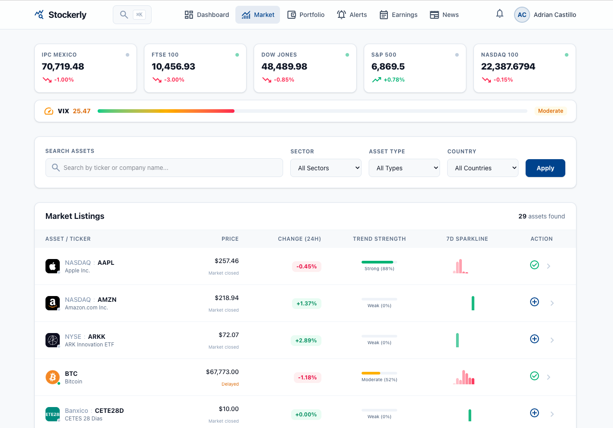
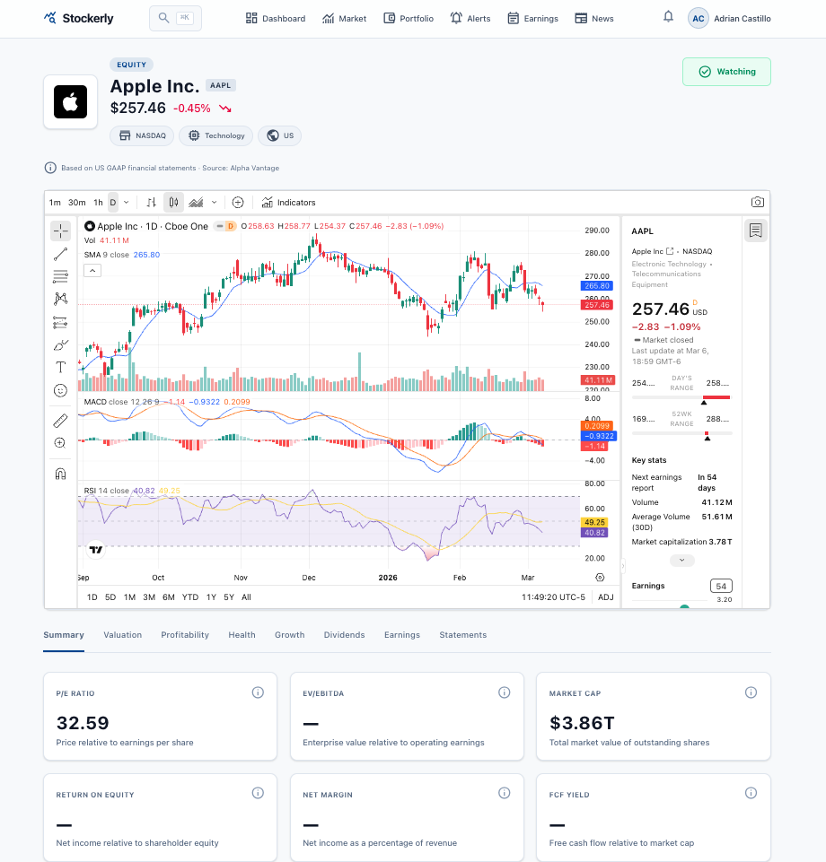
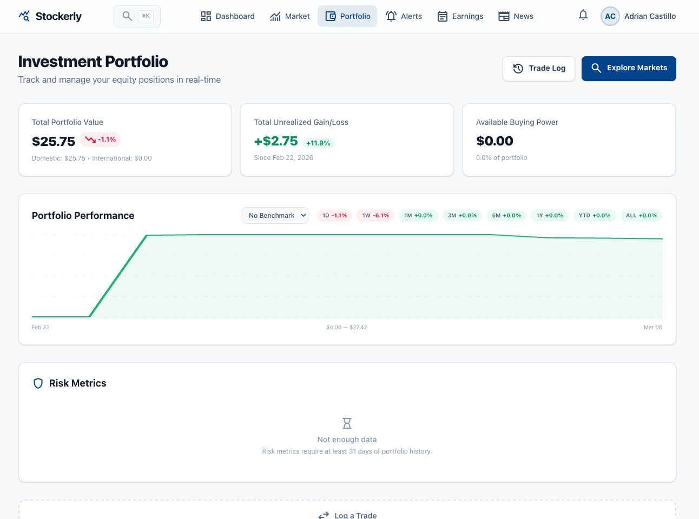
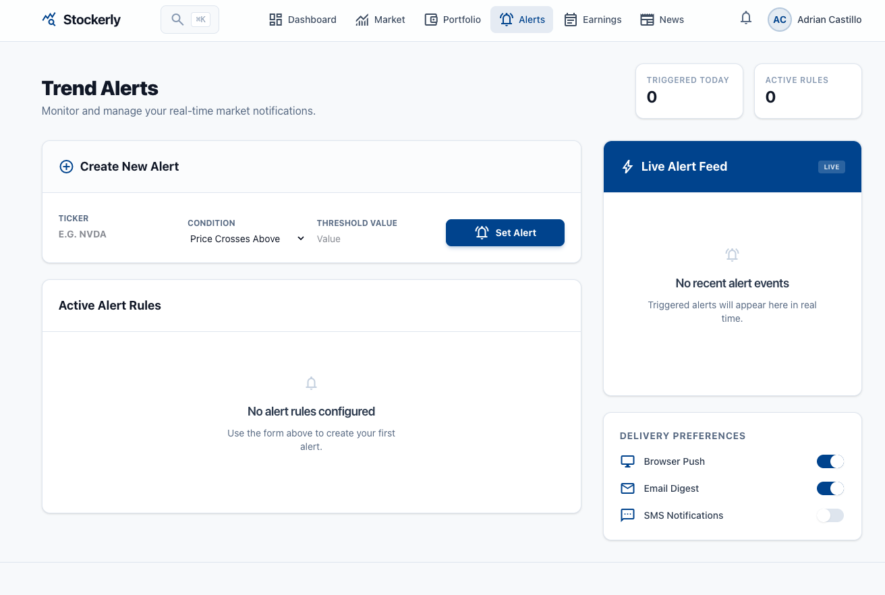
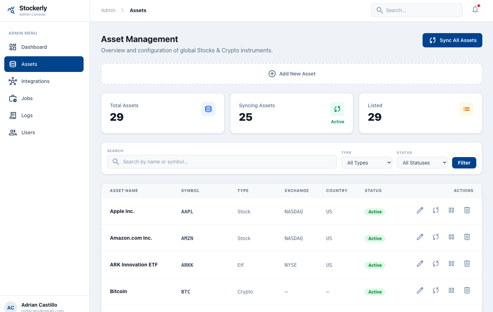
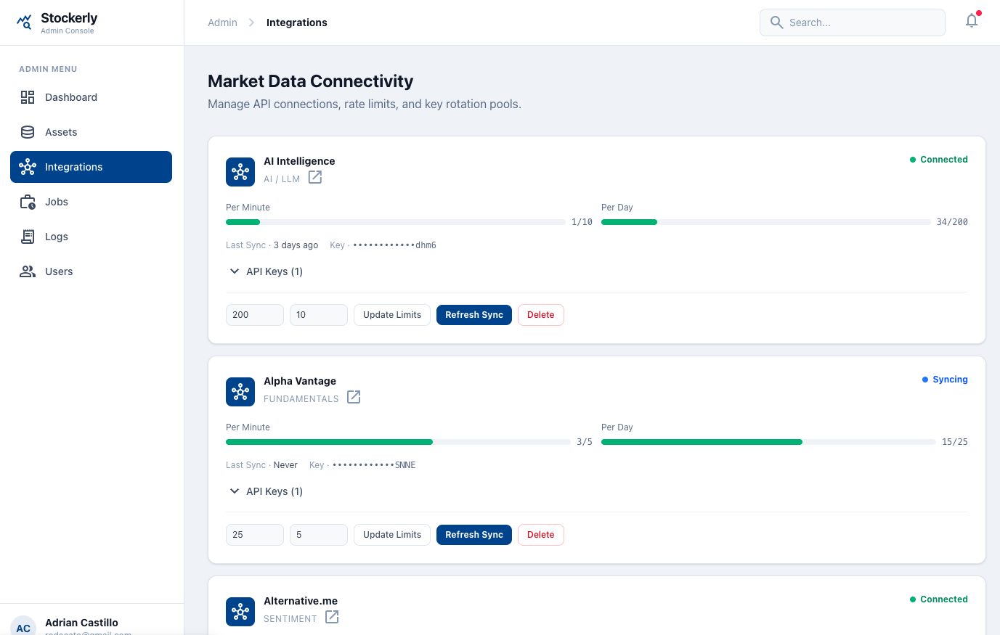
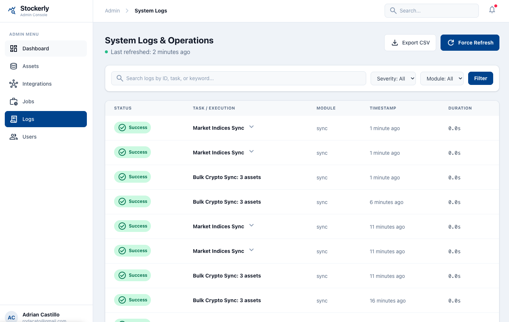

# Stockerly

[](https://github.com/rodacato/stockerly/actions/workflows/ci.yml)
[](https://github.com/rodacato/stockerly/actions/workflows/security.yml)
[](https://github.com/rodacato/stockerly)
[](https://www.ruby-lang.org/)
[](https://rubyonrails.org/)
[](https://www.postgresql.org/)
[](LICENSE)
[](CONTRIBUTING.md)

Open-source fintech platform for market trends, portfolios, alerts, and earnings. Built with Rails 8, PostgreSQL, Hotwire, and Tailwind CSS 4.

100% free and open source — no pricing tiers, no premium features.

## Screenshots

| Dashboard | Market Listings | Asset Detail |
|-----------|----------------|--------------|
|  |  |  |

| Portfolio | Alerts |
|-----------|--------|
|  |  |

| Admin — Assets | Admin — Integrations | Admin — Logs |
|----------------|----------------------|--------------|
|  |  |  |

## Features

- **Portfolio Management** — Track trades, positions, gain/loss, allocation by sector and asset type. Period returns (1D to ALL), TWR benchmarking against S&P 500/NASDAQ/Dow Jones, risk metrics (volatility, Sharpe ratio, max drawdown).
- **Market Intelligence** — 5-factor TrendScore (RSI, Momentum, MACD, Volume, EMA), Fear & Greed Index, market indices with sparklines, asset detail pages with adaptive tabs for stocks and crypto.
- **Alerts** — Price thresholds, sentiment conditions, volume spikes, portfolio concentration risk (HHI). Configurable cooldown system.
- **Earnings Calendar** — Upcoming earnings with beat/miss tracking, EPS bar charts, analyst target prices, and earnings narrative generation.
- **News Feed** — Aggregated financial news with watchlist filtering and optional AI-powered sentiment analysis.
- **AI Intelligence** — Optional LLM-powered insights via multi-provider gateway (Anthropic, OpenAI, or any compatible API). Portfolio analysis, news sentiment, fundamental health checks, earnings narratives.
- **Dividends & Splits** — Automatic tracking and position adjustment on stock splits.
- **Multi-Provider Data** — Polygon.io, Alpha Vantage, CoinGecko, FMP, Banxico. Gateway chains with circuit breakers and adaptive scheduling.
- **PWA** — Installable as a mobile app with offline support.
- **Admin Panel** — Asset management, integration monitoring with rate limit bars, API key pools, system health dashboard, sync logs.

## Architecture

Pragmatic DDD + Hexagonal Architecture with 6 Bounded Contexts:

| Context | Responsibility |
|---------|---------------|
| **Identity** | Registration, auth, profiles, onboarding |
| **Trading** | Trades, portfolios, watchlists, dashboard |
| **Alerts** | Rule management, evaluation, triggering |
| **Market Data** | External data: prices, fundamentals, news, earnings |
| **Administration** | Admin ops, integrations, logs, user management |
| **Notifications** | Notification creation and delivery |

Cross-context communication via domain events only. See [CLAUDE.md](CLAUDE.md) for detailed architecture docs.

## Tech Stack

| Layer | Technology |
|-------|-----------|
| Backend | Ruby 3.3.6, Rails 8.1.2 |
| Database | PostgreSQL 16 (multi-database: primary + Solid Cache + Solid Queue + Solid Cable) |
| Frontend | Hotwire (Turbo + Stimulus), Tailwind CSS 4 |
| Background Jobs | Solid Queue |
| Auth | `has_secure_password` (bcrypt, no Devise) |
| Validation | dry-validation, dry-monads, dry-types, dry-struct |
| Deployment | Kamal 2, Docker, Cloudflare Tunnel |
| CI | GitHub Actions (RSpec, RuboCop, Brakeman, Bundler Audit) |

## Getting Started

### Option 1: Devcontainer (Recommended)

The fastest way to get started. Works with VS Code or GitHub Codespaces.

1. Clone the repo:
   ```bash
   git clone https://github.com/rodacato/stockerly.git
   cd stockerly
   ```

2. Open in VS Code and select **"Reopen in Container"** (or launch in Codespaces)

3. The `postCreateCommand` script handles everything: dependencies, database, migrations.

4. Start the server:
   ```bash
   bin/dev
   ```

5. Visit `http://localhost:3000` — the **Setup Wizard** guides you through initial configuration.

### Option 2: Manual Setup

**Prerequisites:** Ruby 3.3+, PostgreSQL 16, Node.js (for Tailwind CSS).

1. Clone and install:
   ```bash
   git clone https://github.com/rodacato/stockerly.git
   cd stockerly
   bundle install
   ```

2. Create and migrate the database:
   ```bash
   bin/rails db:create db:migrate
   ```

3. Start the server:
   ```bash
   bin/dev
   ```

4. Visit `http://localhost:3000` and follow the Setup Wizard.

### Demo Data

For development with sample data (admin user, assets, trades, alerts):

```bash
bin/rails db:seed
```

This creates an admin user: `admin@stockerly.com` / `password123`

## Configuration

### API Keys

Stockerly integrates with external market data providers. API keys are configured through the admin panel after the Setup Wizard, or via Rails credentials:

| Provider | Free Tier | Data |
|----------|-----------|------|
| [Polygon.io](https://polygon.io/) | 5 calls/min | US stocks, news, earnings |
| [Alpha Vantage](https://www.alphavantage.co/) | 25 calls/day | Fundamentals, financial statements |
| [CoinGecko](https://www.coingecko.com/) | 30 calls/min | Crypto prices and market data |
| [FMP](https://financialmodelingprep.com/) | 250 calls/day | Fundamentals fallback |
| [Banxico](https://www.banxico.org.mx/SieAPIRest/) | Free | CETES rates (Mexican treasury) |

All providers are optional. The app works without any API keys configured — you just won't get live market data.

### AI Intelligence (Optional)

Configure an LLM provider for AI-powered insights:

| Provider | API Format |
|----------|-----------|
| Anthropic (Claude) | Anthropic Messages API |
| OpenAI (GPT) | OpenAI Chat Completions API |
| Custom endpoint | Any compatible API (Ollama, Together, SheLLM) |

Configured through the admin panel under **AI Intelligence**. The app is fully functional without it.

## Running Tests

```bash
# Full suite (~2080 specs)
bundle exec rspec

# Single file
bundle exec rspec spec/contexts/trading/use_cases/execute_trade_spec.rb

# Single example
bundle exec rspec spec/contexts/trading/use_cases/execute_trade_spec.rb:15
```

## Code Quality

```bash
# Linting
bin/rubocop

# Security analysis
bin/brakeman

# Dependency vulnerabilities
bin/bundler-audit

# Full CI pipeline (rubocop + bundler-audit + importmap audit + brakeman + rspec)
bin/ci
```

Install local git hooks to reduce accidental secret leaks:

```bash
bin/setup-hooks
```

## Deployment

Stockerly deploys to any Linux server using **Kamal 2** with Docker.

The reference deployment uses Hetzner VPS + Cloudflare Tunnel (no inbound ports needed).

See [docs/DEPLOY.md](docs/DEPLOY.md) for the complete deployment guide.

## Documentation

| Document | Description |
|----------|-------------|
| [CHANGELOG.md](CHANGELOG.md) | Release history |
| [CONTRIBUTING.md](CONTRIBUTING.md) | How to contribute |
| [RELEASING.md](RELEASING.md) | Versioning and release process |
| [SECURITY.md](SECURITY.md) | Security policy and vulnerability reporting |
| [CLAUDE.md](CLAUDE.md) | Architecture reference (DDD, bounded contexts, conventions) |
| [ROADMAP.md](ROADMAP.md) | Development roadmap and phase history |
| [docs/DEPLOY.md](docs/DEPLOY.md) | Production deployment guide |
| [docs/spec/PRD.md](docs/spec/PRD.md) | Product Requirements Document |
| [docs/spec/DATABASE_SCHEMA.md](docs/spec/DATABASE_SCHEMA.md) | Database schema reference |
| [docs/spec/COMMANDS.md](docs/spec/COMMANDS.md) | Use Cases catalog (DDD) |

## Contributing

We welcome contributions! See [CONTRIBUTING.md](CONTRIBUTING.md) for guidelines.

1. Fork the repository
2. Create your feature branch (`git checkout -b feature/amazing-feature`)
3. Run the tests (`bundle exec rspec`)
4. Commit your changes
5. Open a Pull Request

## License

[MIT](LICENSE) — 100% free and open source.
