<p align="center">
  
</p>

[](https://github.com/rodacato/stockerly/actions/workflows/ci.yml)
[](https://sonarqube.notdefined.dev/dashboard?id=stockerly)
[](https://sonarqube.notdefined.dev/dashboard?id=stockerly)
[](https://sonarqube.notdefined.dev/dashboard?id=stockerly)
[](https://sonarqube.notdefined.dev/dashboard?id=stockerly)
[](https://sonarqube.notdefined.dev/dashboard?id=stockerly)

[](https://www.ruby-lang.org/)
[](https://rubyonrails.org/)
[](https://www.postgresql.org/)
[](https://tailwindcss.com/)
[](LICENSE)

Open-source, self-hosted **single-user** asset tracker for stocks (USD), crypto, and Mexican fixed
income (CETES), with correct MXN/USD multi-currency tracking — the FX rate is captured at the
trade's own date, not at import time. Built with Rails 8, PostgreSQL, Hotwire, and Tailwind CSS 4.
The interface is **es-MX**; the code, routes and docs are English.

100% free and open source — no pricing tiers, no premium features. See
[docs/1.0-retrospective.md](docs/1.0-retrospective.md) for why Stockerly pivoted from a multi-user
beta to a single-user tracker.

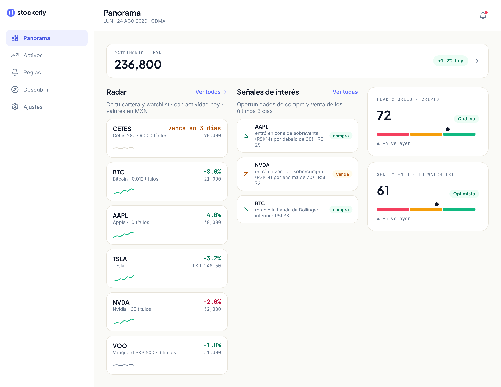

> The images in this README are **artboards from the design system**
> ([`design/`](design/)), not captures of a running instance. A `.pen` file is encrypted JSON, so
> the PNGs in [`design/exports/`](design/exports/) are what makes a design reviewable — and they
> are the closest thing to a current picture of the app that lives in the repo. They are re-shot
> whenever the artboards change; the previous screenshots were captures of the pre-2.0 app and
> were deleted rather than kept as a stale likeness.

## Features

- **Three tiers of asset, not one list** — *Holdings* (what you own), *Watchlist* (what you follow),
  and *Tracked* (the instance's catalogue, which is what the sync jobs read). Adding to the
  catalogue happens at `/tracked`, not in an admin console.
- **Multi-currency that tells the truth** — FX captured at execution (Banxico's fix for the trade's
  date), FX-weighted cost basis, and an unrealised gain split into *what the asset did* vs *what
  the peso did* ([ADR-009](docs/architecture/adr/0009-fx-history-strategy.md)). For a MXN investor
  holding USD assets those are two different stories.
- **Consolidado** — portfolio value over `1M · 3M · 1A · YTD · MAX`, with a time-weighted return
  measured against reinvested CETES: the benchmark a Mexican investor actually gives something up for.
- **Asset detail** — 5-factor TrendScore (RSI, momentum, MACD, volume trend, EMA crossover),
  fundamentals, earnings history and financial statements, each on its own tab.
- **Alerts** — price crossings, day-change %, RSI overbought/oversold, volume spikes, dividend
  ex-dates, BMV holidays and CETES auctions. Per-rule cooldowns.
- **Trade capture built for the chore it is** — a sheet with ticker autocomplete and the Banxico
  rate pre-filled for the date you typed, plus CSV import with a dry-run review step and an
  all-or-nothing refusal when a symbol is unknown.
- **Descubrir** — market-wide waves, basket-filtered headlines and the macro calendar. Reads
  outside the instance's own catalogue, so it works before you hold anything.
- **Two-factor** — TOTP with one-time recovery codes, self-contained, no external identity provider
  ([ADR-018](docs/architecture/adr/0018-totp-with-recovery-codes.md)).
- **Multi-provider market data** — 10 gateways (Alpaca, Finnhub, CoinGecko, DataBursatil, Yahoo
  Finance, Alpha Vantage, FMP, Banxico, ExchangeRate, Alternative.me) behind gateway chains with
  circuit breakers and adaptive scheduling. All optional.
- **Instance operations** — integration health with rate-limit bars, sync logs with CSV export, a
  background-job dashboard, an error tracker that runs *inside* the instance
  ([ADR-020](docs/architecture/adr/0020-internal-error-tracker.md)), and instance settings.
- **PWA** — installable, with push notifications and offline support.

## Architecture

Pragmatic DDD + Hexagonal Architecture with 6 Bounded Contexts:

| Context | Responsibility |
|---------|---------------|
| **Identity** | Single-user auth, two-factor, profile, onboarding |
| **Trading** | Trades, positions, portfolio, watchlist, dashboard |
| **Alerts** | Rule management, evaluation, triggering |
| **Market Data** | External data: prices, fundamentals, earnings, FX |
| **Administration** | Integrations, sync logs, error tracker, instance settings |
| **Notifications** | Notification creation and delivery |

Writes cross contexts through domain events only; reads follow the customer/supplier pattern in
[ADR-002](docs/architecture/adr/0002-trading-marketdata-boundary.md). See [CLAUDE.md](CLAUDE.md)
for the full architecture reference.

## Tech Stack

| Layer | Technology |
|-------|-----------|
| Backend | Ruby 3.3.6, Rails 8.1.2 |
| Database | PostgreSQL 16 (multi-database: primary + Solid Cache + Solid Queue + Solid Cable) |
| Frontend | Hotwire (Turbo + Stimulus), Tailwind CSS 4 |
| Background Jobs | Solid Queue |
| Auth | `has_secure_password` (bcrypt, no Devise) + TOTP with recovery codes |
| Validation | dry-validation, dry-monads, dry-types, dry-struct |
| Copy | Rails I18n, single locale `es-MX`, managed with `i18n-tasks` |
| Deployment | Kamal 2, Docker, Cloudflare Tunnel |
| CI | GitHub Actions (RSpec, RuboCop, Brakeman, Bundler Audit, i18n-tasks) |

## Getting Started

The fastest path is the Dev Container (`Reopen in Container` → `bin/dev`). On bare metal
(Ruby 3.3.6 + PostgreSQL 16), `bin/setup` does the whole thing — gems, databases, server —
and seeds demo data when it creates the database. Then open **`http://localhost:4100`**. The
seeded demo login is `demo@stockerly.com` / `password123` (a regular user, not an admin). An
instance with **no** users opens the Setup Wizard instead, which creates the single account;
because the dev seeds always create users, reaching the wizard takes an empty database. No
Node.js needed.

**See [GETTING_STARTED.md](GETTING_STARTED.md) for the full guide** (both run paths, the
four-database setup, background jobs via `bin/jobs`, first-run check, and troubleshooting).

## Configuration

### API Keys

Stockerly ships **10 market-data gateways** —
[`app/contexts/market_data/gateways/`](app/contexts/market_data/gateways/) holds 14 files: the 10
concrete providers, 2 base classes, 1 error class and 1 retry policy. API keys are configured
during the Setup Wizard, later under Integrations, or via Rails credentials. The registrations in
[`config/initializers/data_sources.rb`](config/initializers/data_sources.rb) are the source of truth:

| Provider | Data it serves |
|----------|----------------|
| [Alpaca](https://alpaca.markets/) | US stocks/ETFs/indices — history, news, dividends, splits |
| [Finnhub](https://finnhub.io/) | US prices, symbol search, news, earnings |
| [CoinGecko](https://www.coingecko.com/) | Crypto prices, history, market data |
| [DataBursatil](https://databursatil.com/) | BMV (Mexican market) prices, history, intraday |
| [Yahoo Finance](https://finance.yahoo.com/) | Prices, history, indices, dividends, splits (Python bridge, [ADR-017](docs/architecture/adr/0017-python-bridge-for-yahoo-finance.md)) |
| [Alpha Vantage](https://www.alphavantage.co/) | Fundamentals |
| [FMP](https://financialmodelingprep.com/) | Fundamentals — maintainer-only; its `/api/v3` is gated to accounts created before 2025-08-31 |
| [Banxico](https://www.banxico.org.mx/SieAPIRest/) | Historical FX fixes and CETES rates |
| [ExchangeRate](https://www.exchangerate-api.com/) | Current FX rates |
| [Alternative.me](https://alternative.me/crypto/fear-and-greed-index/) | Crypto Fear & Greed sentiment |

All providers are optional, and several need no key at all. The app works without any API keys
configured — you just won't get live market data. Rate limits are per-provider settings stored on
each `Integration` record, not hardcoded, so consult the provider's current terms rather than this
table.

## Running Tests

```bash
# Full suite (3,007 examples as of 2026-08-29)
bundle exec rspec

# Single file
bundle exec rspec spec/contexts/trading/use_cases/execute_trade_spec.rb

# Single example
bundle exec rspec spec/contexts/trading/use_cases/execute_trade_spec.rb:15
```

## Code Quality

```bash
# Linting
bin/rubocop

# Security analysis
bin/brakeman

# Dependency vulnerabilities
bin/bundler-audit

# CI pipeline (setup + rubocop + bundler-audit + importmap audit + brakeman)
# Note: bin/ci has no test step — run `bundle exec rspec` separately.
bin/ci
```

Install local git hooks to reduce accidental secret leaks:

```bash
bin/setup-hooks
```

## Deployment

Stockerly deploys to any Linux server using **Kamal 2** with Docker.

The reference deployment uses Hetzner VPS + Cloudflare Tunnel (no inbound ports needed). That
tunnel is how *this* instance is exposed, not a dependency you inherit —
[ADR-019](docs/architecture/adr/0019-self-contained-by-default.md) keeps the app working without
any of the maintainer's infrastructure.

See [docs/ops/deploy.md](docs/ops/deploy.md) for the complete deployment guide, including
[running the read-only Kamal commands from the devcontainer](docs/ops/deploy.md#from-the-devcontainer).

## Documentation

| Document | Description |
|----------|-------------|
| [GETTING_STARTED.md](GETTING_STARTED.md) | Run Stockerly locally — both paths, databases, jobs, troubleshooting |
| [docs/](docs/) | Documentation index (vision, architecture, ops) |
| [docs/vision/](docs/vision/) | Product north, audience, JTBDs, non-goals |
| [docs/architecture/](docs/architecture/) | Bounded contexts map + 19 ADRs |
| [design/](design/) | The design system — Pencil files, ui-kit, brand, exported artboards |
| [docs/ops/github-workflow.md](docs/ops/github-workflow.md) | How work is tracked: the board, issues, PRs |
| [docs/ops/deploy.md](docs/ops/deploy.md) | Production deployment guide |
| [CHANGELOG.md](CHANGELOG.md) | Release history |
| [CONTRIBUTING.md](CONTRIBUTING.md) | Contribution model |
| [RELEASING.md](RELEASING.md) | Versioning and release process |
| [SECURITY.md](SECURITY.md) | Security policy and vulnerability reporting |
| [CLAUDE.md](CLAUDE.md) | Architecture reference (DDD, bounded contexts, conventions) |
| [docs/1.0-retrospective.md](docs/1.0-retrospective.md) | Why Stockerly pivoted from a multi-user beta to a single-user tracker |

## Contributing

Stockerly is a self-hosted single-user tracker, built first as Adrian's daily-driver and packaged
so any technically capable person can stand it up. See
[docs/vision/audience.md](docs/vision/audience.md) for the audience model,
[docs/ops/github-workflow.md](docs/ops/github-workflow.md) for how work is tracked, and
[CONTRIBUTING.md](CONTRIBUTING.md) for how to contribute.

If you find a bug or have a question, open an [issue](https://github.com/rodacato/stockerly/issues).

## Gallery

<details>
<summary>More artboards</summary>

Desktop artboards unless noted. The full index, artboard by artboard, is in
[`design/exports/README.md`](design/exports/README.md).

**Cockpit — asset detail and the consolidated view**

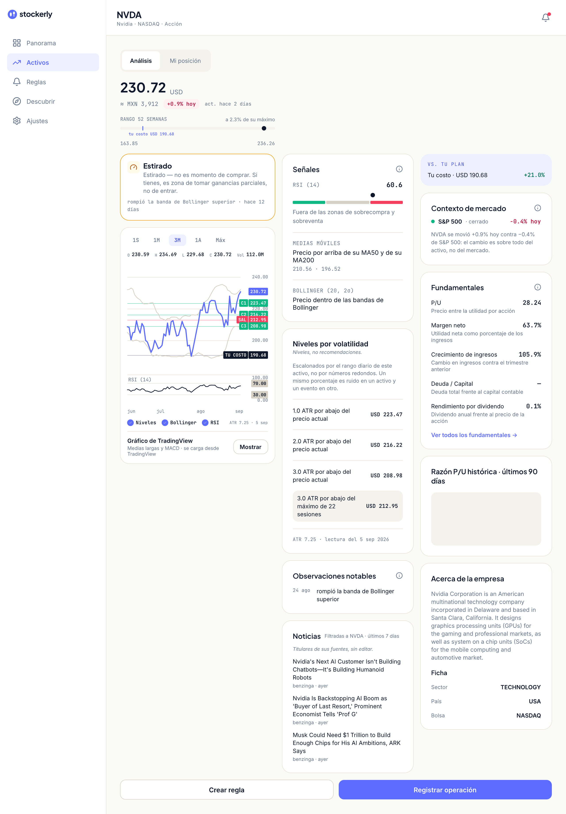
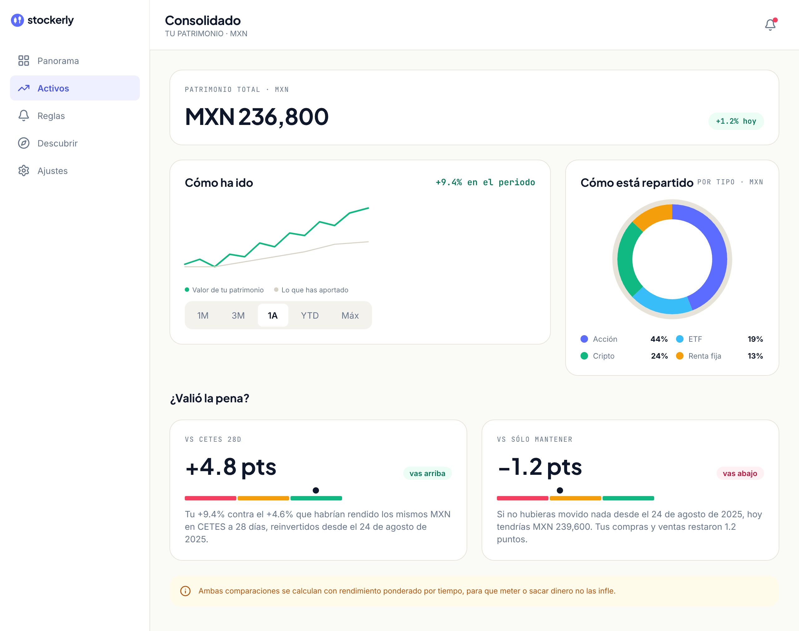

**Activos — holdings, trade capture, CSV import**

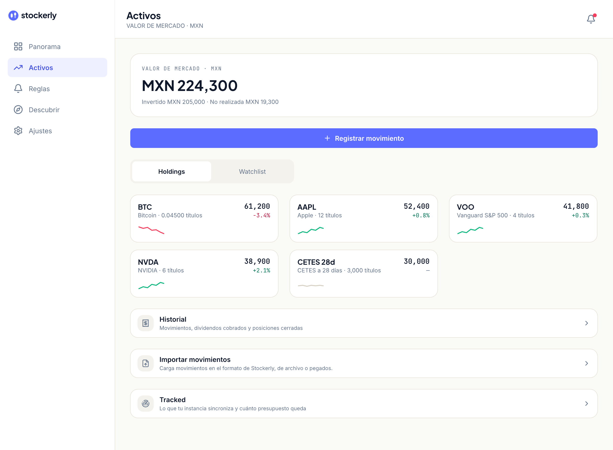
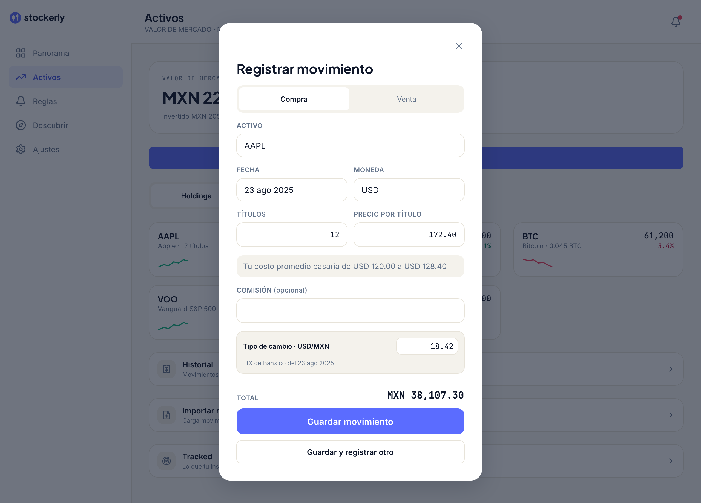
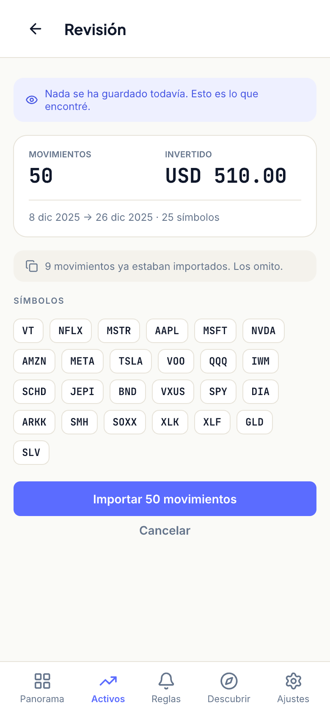

**Reglas y Descubrir**

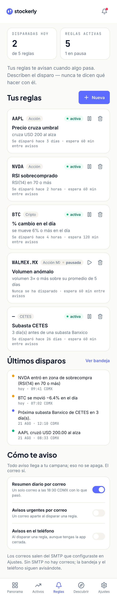
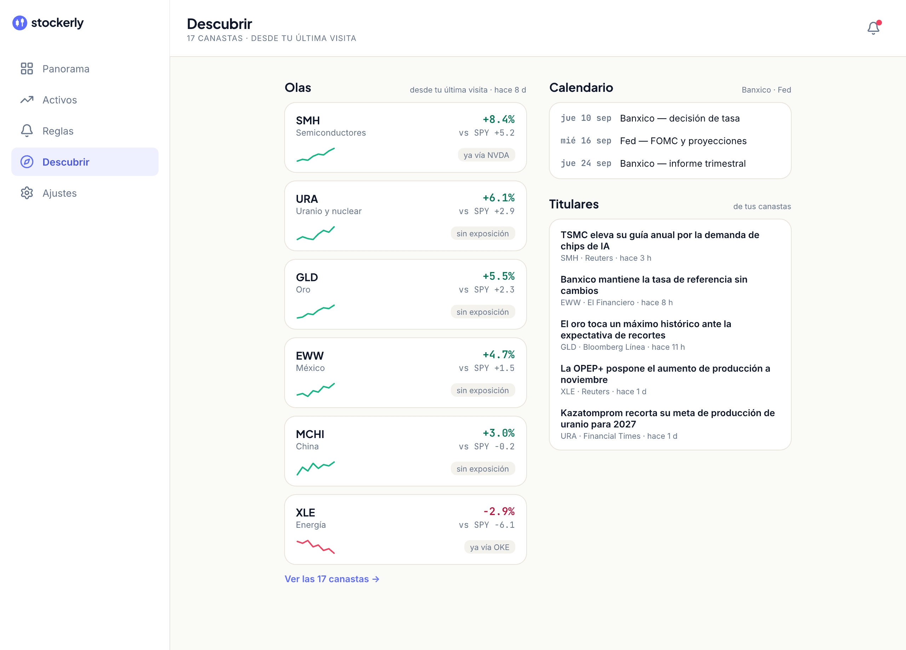

**Onboarding y seguridad**

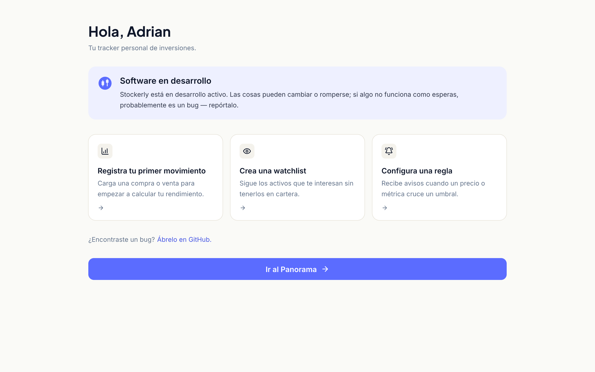
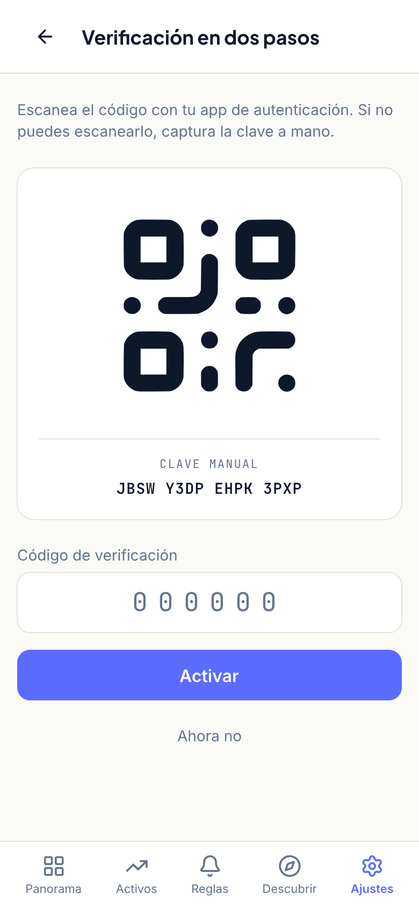

**Ajustes**

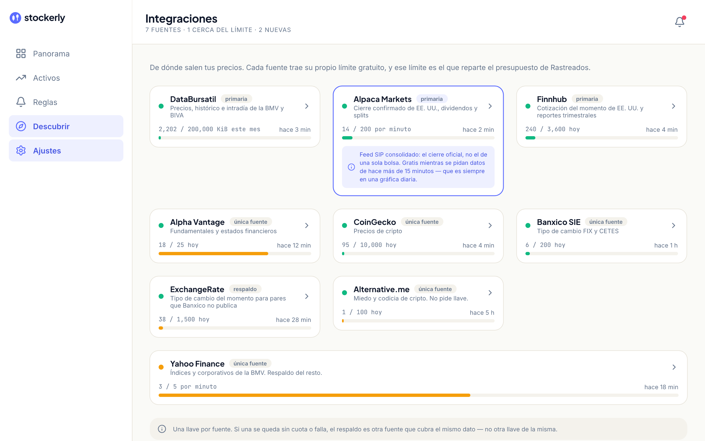
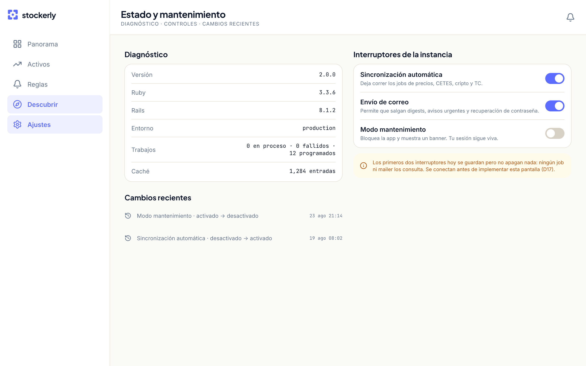

**The one capture of a running instance** — the error tracker shipped after the design pass, so it
has no artboard:

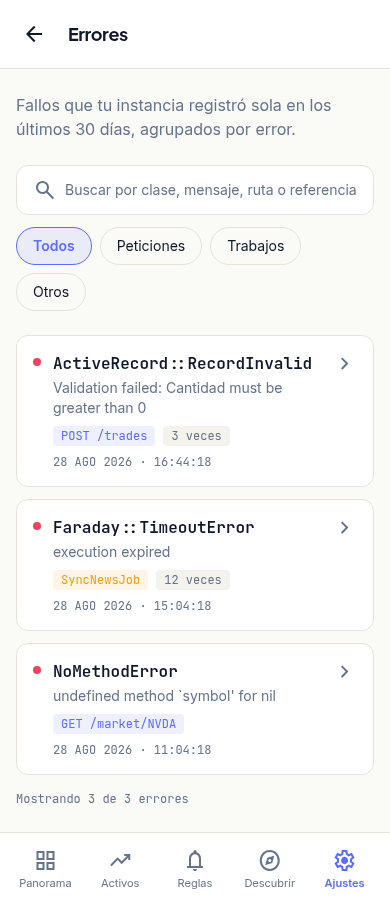

</details>

## License

[MIT](LICENSE) — 100% free and open source.
