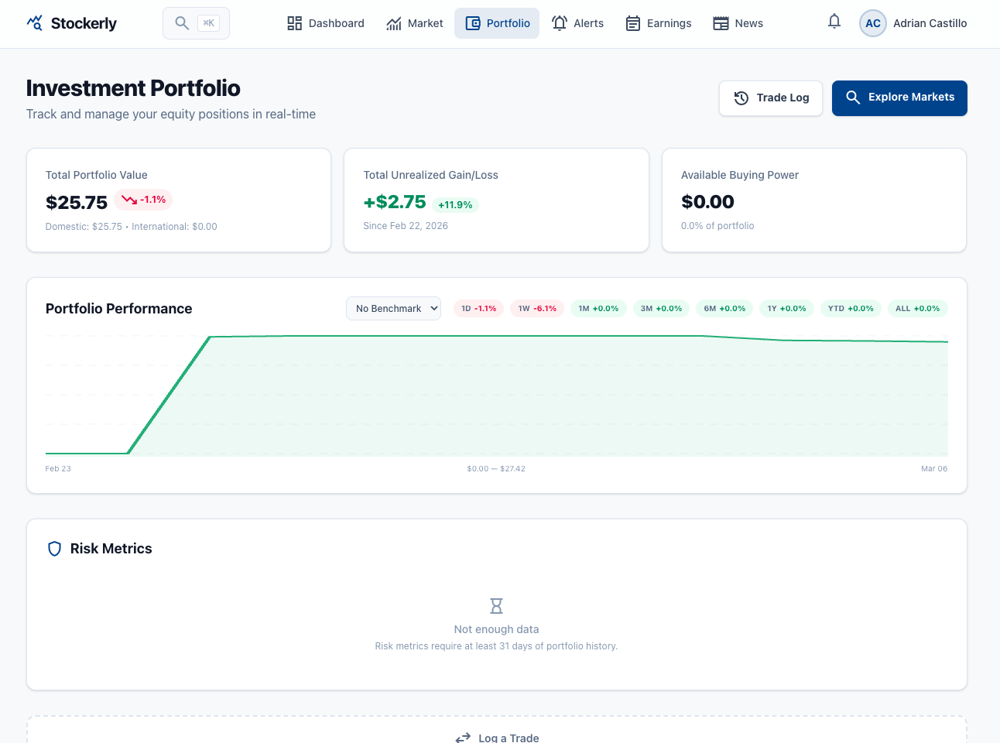
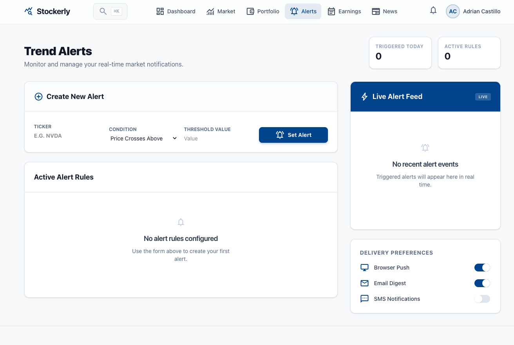
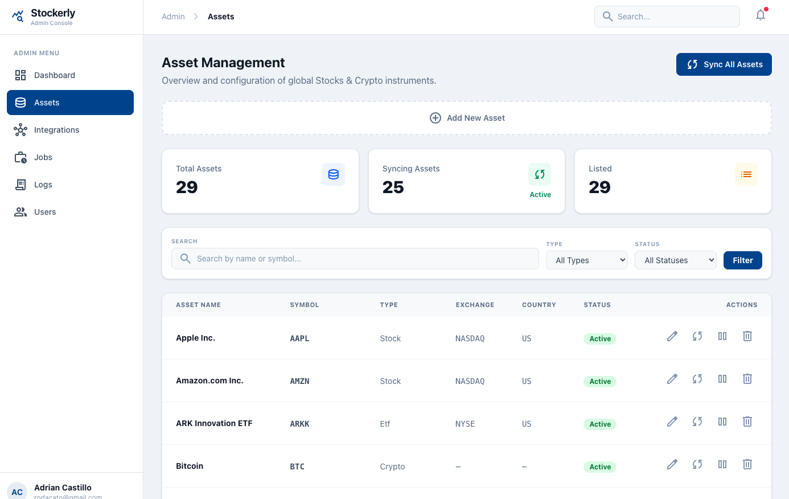
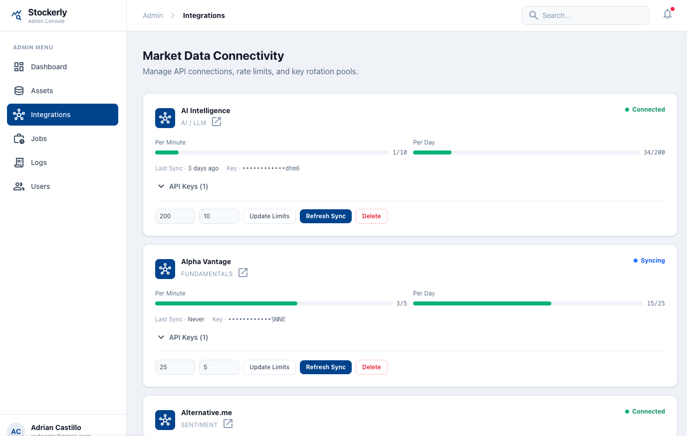
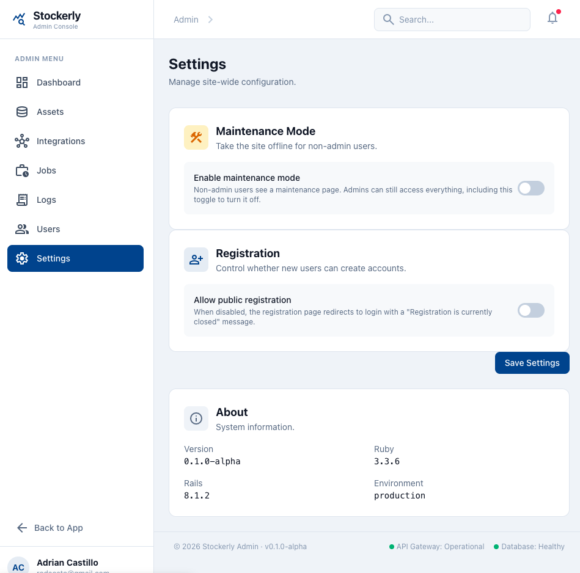
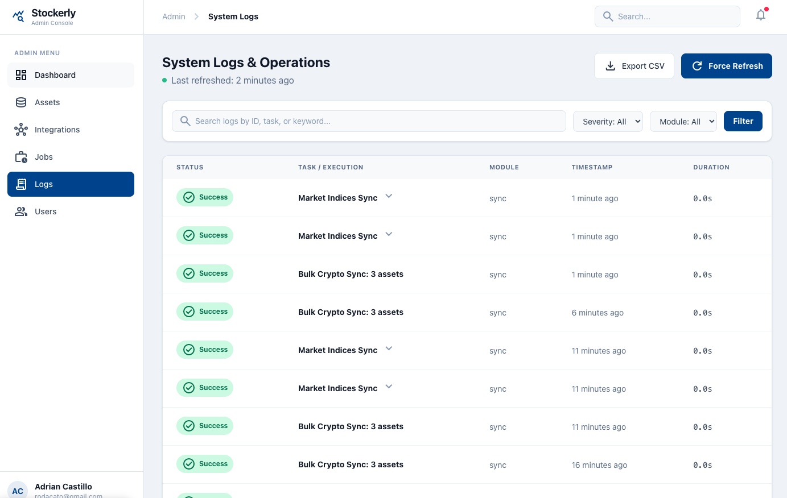

# Stockerly

[](https://github.com/rodacato/stockerly/actions/workflows/ci.yml)
[](https://sonarqube.notdefined.dev/dashboard?id=stockerly)
[](https://sonarqube.notdefined.dev/dashboard?id=stockerly)
[](https://sonarqube.notdefined.dev/dashboard?id=stockerly)
[](https://sonarqube.notdefined.dev/dashboard?id=stockerly)
[](https://sonarqube.notdefined.dev/dashboard?id=stockerly)

[](https://www.ruby-lang.org/)
[](https://rubyonrails.org/)
[](https://www.postgresql.org/)
[](https://tailwindcss.com/)
[](LICENSE)

Open-source, self-hosted single-user asset tracker for stocks (USD), crypto, and Mexican fixed income (CETES), with correct MXN/USD multi-currency tracking. Built with Rails 8, PostgreSQL, Hotwire, and Tailwind CSS 4.

100% free and open source — no pricing tiers, no premium features. See [docs/1.0-retrospective.md](docs/1.0-retrospective.md) for why Stockerly pivoted from a multi-user beta to a single-user tracker.


## Features

- **Portfolio Management** — Track trades, positions, gain/loss, allocation by sector and asset type. Period returns (1D to ALL), TWR benchmarking against S&P 500/NASDAQ/Dow Jones, risk metrics (volatility, Sharpe ratio, max drawdown).
- **Market Intelligence** — 5-factor TrendScore (RSI, Momentum, MACD, Volume, EMA), Fear & Greed Index, market indices with sparklines, asset detail pages with adaptive tabs for stocks and crypto.
- **Alerts** — Price thresholds, sentiment conditions, volume spikes, portfolio concentration risk (HHI). Configurable cooldown system.
- **Earnings Calendar** — Upcoming earnings with beat/miss tracking, EPS bar charts, analyst target prices, and earnings narrative generation.
- **News Feed** — Aggregated financial news with watchlist filtering.
- **Dividends & Splits** — Automatic tracking and position adjustment on stock splits.
- **Multi-Provider Data** — Polygon.io, Alpha Vantage, CoinGecko, FMP, Banxico. Gateway chains with circuit breakers and adaptive scheduling.
- **PWA** — Installable as a mobile app with offline support.
- **Admin Panel** — Asset management, integration monitoring with rate limit bars, API key pools, system health dashboard, sync logs.

## Architecture

Pragmatic DDD + Hexagonal Architecture with 6 Bounded Contexts:

| Context | Responsibility |
|---------|---------------|
| **Identity** | Single-user auth, profile, onboarding |
| **Trading** | Trades, portfolios, watchlists, dashboard |
| **Alerts** | Rule management, evaluation, triggering |
| **Market Data** | External data: prices, fundamentals, news, earnings |
| **Administration** | Admin ops, integrations, logs, settings |
| **Notifications** | Notification creation and delivery |

Cross-context communication via domain events only. See [CLAUDE.md](CLAUDE.md) for detailed architecture docs.

## Tech Stack

| Layer | Technology |
|-------|-----------|
| Backend | Ruby 3.3.6, Rails 8.1.2 |
| Database | PostgreSQL 16 (multi-database: primary + Solid Cache + Solid Queue + Solid Cable) |
| Frontend | Hotwire (Turbo + Stimulus), Tailwind CSS 4 |
| Background Jobs | Solid Queue |
| Auth | `has_secure_password` (bcrypt, no Devise) |
| Validation | dry-validation, dry-monads, dry-types, dry-struct |
| Deployment | Kamal 2, Docker, Cloudflare Tunnel |
| CI | GitHub Actions (RSpec, RuboCop, Brakeman, Bundler Audit) |

## Getting Started

The fastest path is the Dev Container (`Reopen in Container` → `bin/dev`). On bare metal
(Ruby 3.3.6 + PostgreSQL 16), `bin/setup` does the whole thing — gems, databases, demo data,
server. Then open **`http://localhost:4100`**. The seeded admin login is
`admin@stockerly.com` / `password123`. No Node.js needed.

**See [GETTING_STARTED.md](GETTING_STARTED.md) for the full guide** (both run paths, the
four-database setup, background jobs via `bin/jobs`, first-run check, and troubleshooting).

## Configuration

### API Keys

Stockerly integrates with external market data providers. API keys are configured through the admin panel after the Setup Wizard, or via Rails credentials:

| Provider | Free Tier | Data |
|----------|-----------|------|
| [Polygon.io](https://polygon.io/) | 5 calls/min | US stocks, news, earnings |
| [Alpha Vantage](https://www.alphavantage.co/) | 25 calls/day | Fundamentals, financial statements |
| [CoinGecko](https://www.coingecko.com/) | 30 calls/min | Crypto prices and market data |
| [FMP](https://financialmodelingprep.com/) | 250 calls/day | Fundamentals fallback |
| [Banxico](https://www.banxico.org.mx/SieAPIRest/) | Free | CETES rates (Mexican treasury) |

All providers are optional. The app works without any API keys configured — you just won't get live market data.

## Running Tests

```bash
# Full suite (~2080 specs)
bundle exec rspec

# Single file
bundle exec rspec spec/contexts/trading/use_cases/execute_trade_spec.rb

# Single example
bundle exec rspec spec/contexts/trading/use_cases/execute_trade_spec.rb:15
```

## Code Quality

```bash
# Linting
bin/rubocop

# Security analysis
bin/brakeman

# Dependency vulnerabilities
bin/bundler-audit

# Full CI pipeline (rubocop + bundler-audit + importmap audit + brakeman + rspec)
bin/ci
```

Install local git hooks to reduce accidental secret leaks:

```bash
bin/setup-hooks
```

## Deployment

Stockerly deploys to any Linux server using **Kamal 2** with Docker.

The reference deployment uses Hetzner VPS + Cloudflare Tunnel (no inbound ports needed).

See [docs/ops/deploy.md](docs/ops/deploy.md) for the complete deployment guide.

## Documentation

| Document | Description |
|----------|-------------|
| [GETTING_STARTED.md](GETTING_STARTED.md) | Run Stockerly locally — both paths, databases, jobs, troubleshooting |
| [docs/](docs/) | Documentation index (vision, architecture, ops) |
| [docs/vision/](docs/vision/) | Product north, audience, JTBDs, non-goals |
| [docs/architecture/](docs/architecture/) | Bounded contexts map + ADRs |
| [docs/ops/deploy.md](docs/ops/deploy.md) | Production deployment guide |
| [CHANGELOG.md](CHANGELOG.md) | Release history |
| [CONTRIBUTING.md](CONTRIBUTING.md) | Contribution model |
| [RELEASING.md](RELEASING.md) | Versioning and release process |
| [SECURITY.md](SECURITY.md) | Security policy and vulnerability reporting |
| [CLAUDE.md](CLAUDE.md) | Architecture reference (DDD, bounded contexts, conventions) |
| [docs/1.0-retrospective.md](docs/1.0-retrospective.md) | Why Stockerly pivoted from a multi-user beta to a single-user tracker |

## Contributing

Stockerly is a self-hosted single-user tracker, built first as Adrian's daily-driver and packaged so any technically capable person can stand it up. See [docs/vision/audience.md](docs/vision/audience.md) for the audience model and [CONTRIBUTING.md](CONTRIBUTING.md) for how to contribute.

If you find a bug or have a question, open an [issue](https://github.com/rodacato/stockerly/issues).

## Gallery

<details>
<summary>More screenshots</summary>










</details>

## License

[MIT](LICENSE) — 100% free and open source.
